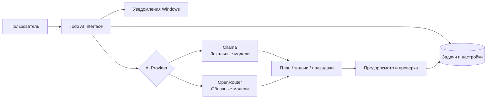

<div align="center">

# ✅ Todo AI

### Умный desktop-планировщик задач с AI-ассистентом

Создавайте задачи обычным текстом, планируйте день, настраивайте повторения и используйте локальные или облачные нейросети в минималистичном Windows-приложении.

<br />


<br />

[📥 Скачать приложение](https://github.com/ArturKamnev/todo-list/releases/latest)
&nbsp;•&nbsp;
[🐞 Сообщить о проблеме](https://github.com/ArturKamnev/todo-list/issues)
&nbsp;•&nbsp;
[📦 Все версии](https://github.com/ArturKamnev/todo-list/releases)

</div>

---

> [!IMPORTANT]
> ## 🧪 Todo AI находится в Beta-версии
>
> Приложение активно разрабатывается. Некоторые функции могут изменяться, а в отдельных сценариях возможны ошибки.
>
> Если вы нашли баг или хотите предложить улучшение, создайте обращение в разделе [Issues](https://github.com/ArturKamnev/todo-list/issues).

---

## Что такое Todo AI?

**Todo AI** — это приложение для планирования задач на Windows, в котором обычный todo-list объединён с AI-функциями, календарным планированием, визуализацией дня и напоминаниями.

Вместо ручного заполнения множества полей можно написать:

```text
Завтра в 17:00 сходить на курсы, потом час поработать над проектом,
а каждую пятницу вечером напоминать про уборку.
```

Todo AI поможет превратить это в удобные задачи с датой, временем, длительностью и повторением.

---

## ✨ Возможности

### 📋 Задачи и расписание

- Создание, редактирование и удаление задач
- Точная дата и время выполнения
- Длительность задачи
- Категории / проекты
- Подзадачи
- Повторяющиеся задачи
- Повторение по выбранным дням недели
- Исключения из повторений
- Поиск и фильтрация задач

### 🗓 Визуализация дня

Отдельная вкладка показывает день в виде понятной временной шкалы:

```text
09:00 ┃ Подготовиться к алгебре
11:30 ┃ Работа над проектом
13:20 ┃ Сходить на курсы
18:00 ┃ Тренировка
```

Задачи располагаются по времени, а их длительность помогает увидеть загруженность дня.

### 🤖 AI-помощник

AI в Todo AI помогает:

- создавать задачи из обычного описания;
- планировать день;
- разбивать большие задачи на небольшие шаги;
- работать с датами, временем и повторениями;
- формировать более понятное расписание.

Все действия, влияющие на задачи, проходят через интерфейс приложения и могут быть проверены пользователем перед применением.

### 🔔 Уведомления

Todo AI умеет напоминать о запланированных задачах прямо на компьютере.

Доступны напоминания:

- в момент начала задачи;
- за 5 минут;
- за 10 минут;
- за 30 минут;
- за 1 час.

### 🎨 Интерфейс

- Минималистичный desktop-дизайн
- Тёмная и светлая тема
- Русский и английский язык
- Красивый onboarding при первом запуске
- Плавные анимации
- Удобная работа в окне разных размеров

---

## 🧠 Поддерживаемые AI-провайдеры

### Локальные модели — Ollama

Локальный режим позволяет запускать нейросеть прямо на компьютере.

Преимущества:

- задачи остаются на вашем устройстве;
- API-ключ не требуется;
- можно выбирать установленные модели;
- доступны установка и удаление моделей через интерфейс приложения.

> Для локальных моделей производительность зависит от характеристик компьютера и размера выбранной модели.

### Облачные модели — OpenRouter

Облачный режим позволяет использовать AI через API-ключ OpenRouter.

В приложении доступен режим:

```text
Auto Free Model
```

Он автоматически выбирает доступную бесплатную модель OpenRouter.

> [!NOTE]
> Бесплатные облачные модели могут иметь ограничения по скорости, доступности и количеству запросов.

---

## 🔄 Как работает Todo AI



---

## 📥 Как установить приложение

### Windows

1. Откройте страницу последней версии:

   [Скачать Todo AI](https://github.com/ArturKamnev/todo-list/releases/latest)

2. В разделе **Assets** скачайте файл:

```text
Todo-AI-Setup-x.x.x.exe
```

3. Запустите скачанный установщик.

4. После установки откройте **Todo AI**.

5. При первом запуске приложение поможет:

   - выбрать язык;
   - выбрать тему оформления;
   - подключить локальный или облачный AI;
   - выбрать или установить модель;
   - настроить уведомления.

---

## 🔄 Обновления приложения

Todo AI поддерживает автоматические обновления.

Когда выходит новая версия, приложение может:

- проверить наличие обновления;
- предложить его скачать;
- установить обновление после перезапуска.

Проверить обновления вручную можно в настройках приложения:

```text
Настройки → О приложении → Проверить обновления
```

---

## 🔐 Приватность

- Задачи и настройки приложения сохраняются локально на компьютере.
- При использовании **Ollama** AI работает локально на устройстве.
- При использовании **OpenRouter** запросы отправляются выбранному облачному AI-провайдеру.
- API-ключ не должен отображаться в интерфейсе или попадать в публичные логи.

---

## 🗺 Что планируется дальше

Todo AI всё ещё развивается. В будущих версиях могут появиться:

- более умное планирование дня;
- автоматическое перепланирование невыполненных задач;
- личное расписание свободного времени;
- быстрый ввод задач через горячую клавишу;
- улучшенные действия из уведомлений;
- резервное копирование и импорт задач;
- расширенная визуализация расписания;
- недельный обзор продуктивности.

---

## ⚠️ Известные ограничения Beta-версии

На текущем этапе возможны:

- нестабильные ответы некоторых AI-моделей;
- ограничения бесплатных моделей OpenRouter;
- изменения интерфейса в новых версиях;
- отдельные ошибки при нестандартных сценариях использования.

Сообщить о найденной проблеме можно здесь:

[Создать Issue](https://github.com/ArturKamnev/todo-list/issues/new)

---

<div align="center">

## Todo AI 🧪 Beta

Умный desktop-планировщик задач, который постепенно превращается в полноценного AI-помощника для организации дня.

<br />

**Todo AI © 2026**

</div>